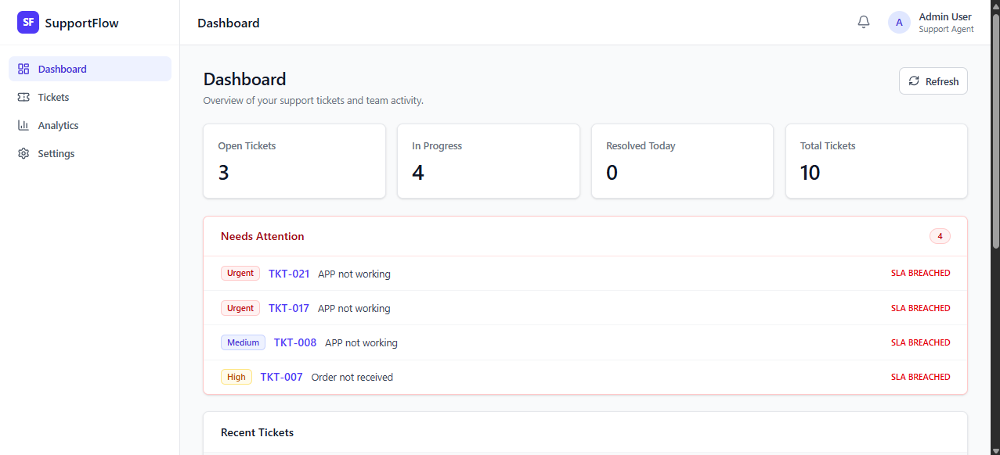
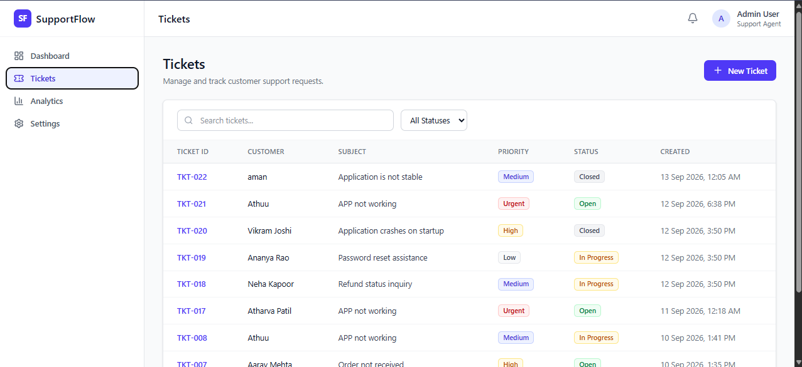
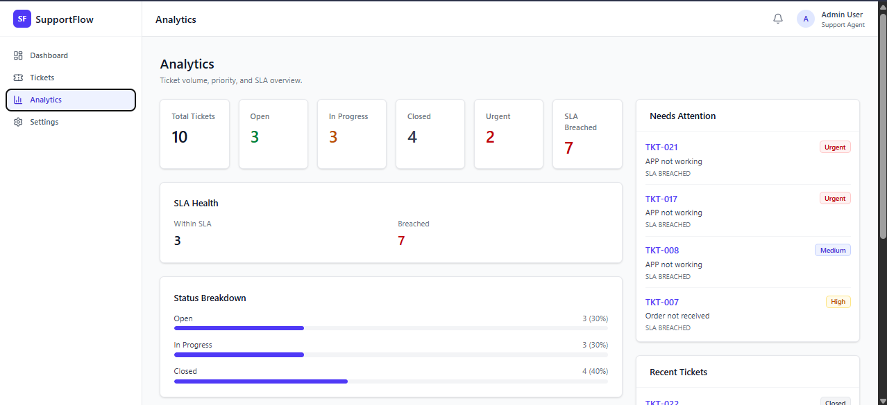

# SupportFlow

SupportFlow is a customer support ticketing CRM built for the Datastraw technical internship assessment. It lets support teams create, search, prioritize, and track tickets with automatic SLA management.

## Overview

SupportFlow provides a clean internal workspace for managing support requests. Agents can create tickets, update statuses, add notes, and see which tickets need attention first through priority levels and SLA deadlines.

## Features

- Create tickets
- Ticket listing
- Search across ticket ID, customer name, email, subject, and description
- Status filtering (Open / In Progress / Closed)
- Ticket details
- Status updates
- Notes / activity timeline
- Priority management (Low / Medium / High / Urgent)
- SLA tracking with breach detection
- Needs Attention workflow
- Dashboard with live stats
- Analytics with status, priority, and SLA breakdowns
- Responsive UI for desktop and mobile

## Standout Feature — Priority + SLA Management

Every ticket has a priority level:

- Low — 72 hour SLA
- Medium — 24 hour SLA
- High — 4 hour SLA
- Urgent — 1 hour SLA

The backend calculates the SLA deadline automatically based on the selected priority. The frontend shows remaining time and flags breached SLAs. The Needs Attention section surfaces active urgent or SLA-breached tickets so agents can focus on what matters most.

This mirrors how real support teams triage work: priority determines urgency, and the SLA deadline creates a clear time boundary for action.

## Tech Stack

Frontend:
- React
- Vite
- Tailwind CSS
- React Router
- Lucide React

Backend:
- Python
- FastAPI
- SQLAlchemy

Database:
- Supabase PostgreSQL

Deployment:
- Railway

## Architecture

Browser
  ↓
React/Vite Frontend
  ↓
FastAPI REST API
  ↓
SQLAlchemy ORM
  ↓
Supabase PostgreSQL

The frontend is a single-page React app. The backend exposes a small REST API. SQLAlchemy handles the data layer. Supabase hosts the PostgreSQL database in production.

## Project Structure

```
.
├── backend/
│   ├── .env.example
│   ├── .gitignore
│   ├── app/
│   │   ├── database.py
│   │   ├── main.py
│   │   ├── models.py
│   │   ├── schemas.py
│   │   └── routes/
│   │       └── tickets.py
│   ├── migrate_to_postgres.py
│   └── requirements.txt
├── frontend/
│   ├── .env.example
│   ├── .gitignore
│   ├── index.html
│   ├── package.json
│   ├── vite.config.js
│   └── src/
│       ├── components/
│       ├── pages/
│       ├── services/
│       ├── utils/
│       ├── App.jsx
│       ├── index.css
│       └── main.jsx
├── .gitignore
├── render.yaml
└── README.md
```

## Local Development

### Backend

```bash
cd backend
python -m venv .venv
.venv\Scripts\activate
pip install -r requirements.txt
uvicorn app.main:app --reload
```

### Frontend

```bash
cd frontend
npm install
npm run dev
```

## Environment Variables

Backend:
- `DATABASE_URL` — Supabase PostgreSQL connection string
- `FRONTEND_URL` — allowed CORS origin(s), comma-separated

Frontend:
- `VITE_API_BASE_URL` — backend API base URL

Example local values:

```
DATABASE_URL=your_supabase_postgresql_connection_string
FRONTEND_URL=http://localhost:5173
VITE_API_BASE_URL=http://localhost:8000
```

Production values are configured through Railway environment variables.

## API Endpoints

- `GET /api/health` — health check
- `GET /api/tickets` — list tickets
  - Query: `?search=` and `?status=`
- `POST /api/tickets` — create ticket
- `GET /api/tickets/{ticket_id}` — ticket detail
- `PUT /api/tickets/{ticket_id}` — update ticket

## Database

The application uses Supabase PostgreSQL through SQLAlchemy. The local SQLite file (`support_crm.db`) is retained as a backup only.

Tables:
- `tickets` — ticket_id, customer_name, customer_email, subject, description, status, priority, sla_due_at, created_at, updated_at
- `notes` — ticket_id, note_text, created_at

## Deployment

SupportFlow is deployed on Railway:

- Frontend: React/Vite static build
- Backend: FastAPI web service
- Database: Supabase PostgreSQL

Environment variables are configured in Railway. CORS is restricted to the deployed frontend origin.

## Challenges Solved

- SQLite to Supabase PostgreSQL migration with preserved data
- Production environment configuration via environment variables
- Railway deployment setup
- Frontend/backend CORS configuration
- Persistent database verification across backend restarts

## Future Improvements

- Authentication and role-based access
- Customer profiles and contact history
- Email/channel integrations
- Team assignment and routing
- More advanced reporting and export

## Screenshots / Demo

### 1. Dashboard & Needs Attention
Overview of active support tickets, key operational metrics, and immediate SLA breach alerts.



### 2. Tickets Management
Comprehensive ticket list with real-time multi-field search, status filtering, and priority indicators.



### 3. Analytics & SLA Health
Detailed breakdown of SLA compliance, ticket status distributions, and triage monitoring.



